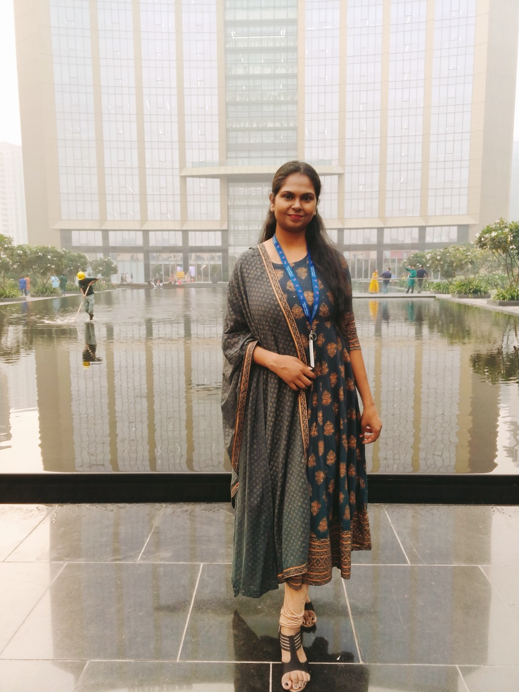

**Matrimonial Biodata**

---

**Name:** Ritu Singh

---

**About:**

- **Date of Birth:** 18th September 1993
- **Place of Birth:** Delhi
- **Time of Birth:** 10:15 AM
- **Height:** 5' 6''
- **Complexion:** Dusky
- **Religion:** Hindu
- **Gotra:** Handa
- **Sunshine:** Virgo
- **Address:** Khora Colony, Ghaziabad

---

**Contact Information:**

- **Mother's Contact:** +91-9210745950
- **Email:** ritusing1809@gmail.com

---

**What I Do:**

A dedicated Chartered Accountant with a knack for financial analysis and strategic planning. Passionate about teaching and sharing knowledge with others, and always eager to explore creative outlets through sketching.

---

**Interests:**

- **Teaching:** Sharing knowledge and inspiring others.
- **Sketching:** Exploring creative expressions through art.
- **Entertainment:** Watching online web series, TV shows, and movies.
- **Travel:** Open to new experiences and exploring new places.
- **Fitness:** Does regular yoga and maintains an healthy lifestyle.

---

**Personality Traits:**

- **Compassionate:** Empathetic and understanding towards others.
- **Creative:** Loves to explore and create new ideas through art.
- **Humorous:** Enjoys bringing joy and laughter to those around her.
- **Open-minded:** Always ready to embrace new ideas and perspectives.
- **Adaptable:** Easily adjusts to new situations and environments.

---

**Education:**

- **Chartered Accountancy:**
  - CA Final – Nov 2022
  - CA Inter – Nov 2017

- **Bachelor of Commerce:** 
  - Graduated in 2015

- **CBSE:**
  - Class 12 – 2011
  - Class 10 – 2009

---

**Career:**

Chartered Accountant with a strong foundation in accounting, financial management and strategic planning. Currently working at Genpact working as managment trainee. Also seeking better opportunities to further apply skills in dynamic environments.

---

**Family Details:**

- **Father:** Late Mr Kamlesh Singh, School owner
- **Mother:** Mrs. Rekha Singh, Homemaker
- **Siblings:**  
  Amit Singh, Software Engineer  
  Sumit Singh, Dentist (BDS)

---

**Looking For**
I'm seeking a partner who is caring and respectful, with a lifestyle that includes being **vegetarian, non-drinking, and non-smoking**. This person should value family deeply and aspire to be a devoted family man. Together, we would create a nurturing and supportive home environment.

---

**Photos**

  
 Click! 📸 

  
  
  
  

